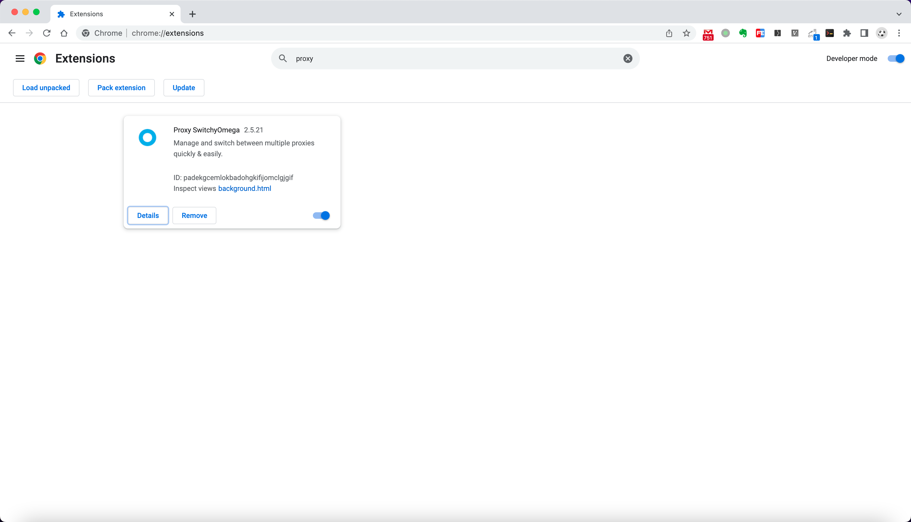
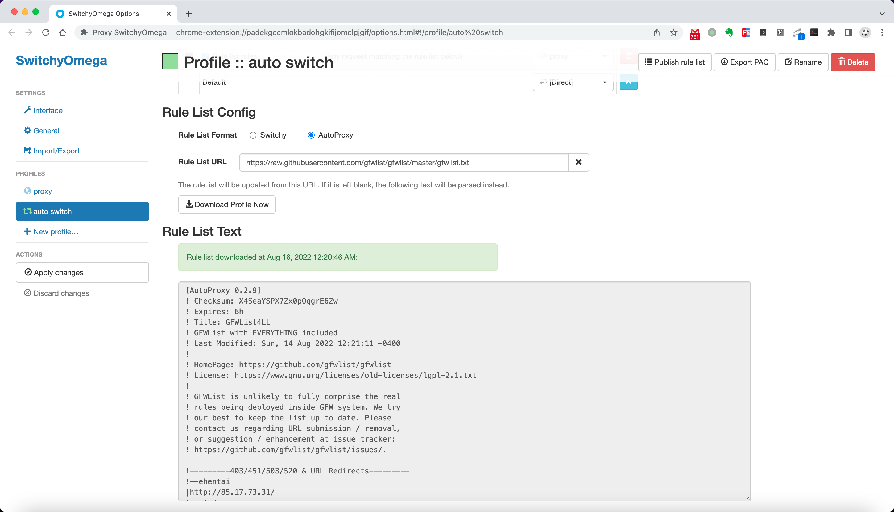
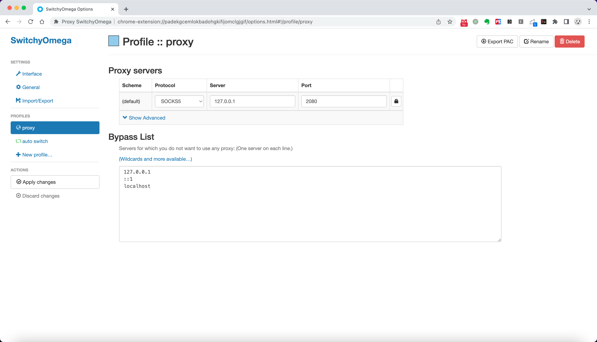
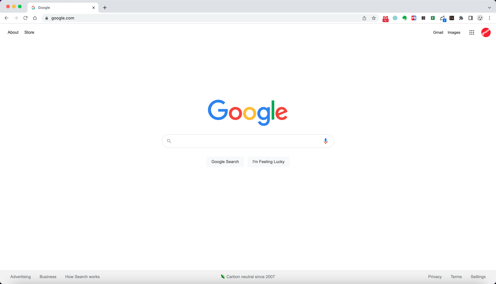

### quick start
* script menu
```shell
./run.sh -h
usage: ./run.sh [ -o build/push/run/remove ]

    -h : Help info
    -o : Run options
```

* custom config fields
```shell
    "remote_addr": "example.com",  #remote trojan server address
    "password": [
        "password"  #remote trojan server password
    ],
    
    "cert": "/trojan/fullchain.cer", #remote trojan server certificate
```

* start trojan client container
```shell
    $ cp -vf config.json.example config.json
    $ ./run.sh -o run
    $ 792a0ae43bf6d49a53ca44e757c280c2bec5bd0706e2c9b53bbeceaf6136700f
    $ docker ps
    CONTAINER ID        IMAGE                   COMMAND                  CREATED             STATUS              PORTS                    NAMES
    792a0ae43bf6        gooner/trojan:v1.16.0   "/trojan/trojan -c /…"   3 seconds ago       Up 1 second         0.0.0.0:2080->1080/tcp   trojan-client
```

* access with trojan client
```shell
    # access socks5 proxy port
    $ telnet 127.0.0.1 2080
    Trying 127.0.0.1...
    Connected to localhost.
    Escape character is '^]'.

    Connection closed by foreign host.

    # access remote address
    curl --socks5-hostname localhost:2080 https://www.google.com
```

* install chrome extensions
  

* config auto switch profile
  - Rule List Config
    - Step 1
      Rule List Format: AutoProxy
    - Step 2
      Rule List URL: https://raw.githubusercontent.com/gfwlist/gfwlist/master/gfwlist.txt
    - Step 3 
      Download Profile Now

    

* config socks5 proxy
  - Proxy servers
    - Step 1
      Protocol: SOCKS5, Server: 127.0.0.1, Port 2080(just container listen port)
    - Step 2
      Bypass List, e.g 127.0.0.1, localhost, www.baidu.com

    

* chrome proxy access
  